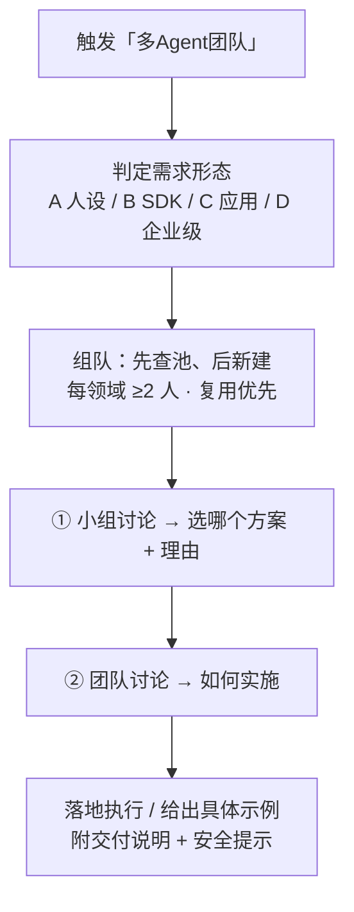

# 技能包：多智能体团队搭建（multi-agent-team）

一句话：**你说一句"帮我组个多 Agent 团队"，它就从角色池挑专家、按领域组成小组，经"小组讨论 → 团队讨论"两级收敛，直接给你能跑的方案或具体示例。**

> 🌐 英文版（English version）：https://github.com/zhangruilin158/multi-agent-team-en —— 同一套规则的全英文技能，已发布（SKILL/README 均为英文，角色池为英文子集 304 角色 / 19 领域）。

## 全景流程



## 它做什么

1. **选型不纠结** —— 内部判定需求形态并直接搭起来，不输出纯建议就停。
2. **组队不手写** —— 从统一角色池（335 个唯一角色 / 23 个领域）复用现成专家人设，池里没有的才新建。
3. **两级讨论收敛** —— 每领域 ≥2 人组成小组：小组选方案、团队定实施。
4. **落地可运行** —— 自带可插拔引擎脚手架，改一个 `TEAM` 配置就能跑。

## 包里有什么

```
multi-agent-team/
├── SKILL.md                        # 技能本体（完整规则）
├── README.md  UPLOAD.md  LICENSE
├── references/
│   ├── 统一角色池.md                # ★去重 335 角色 —— 组队用
│   ├── agent-全量清单.md            # ★不去重 608 条 —— 讨论用
│   ├── 功能与流程总览.md            # 全部流程图（7 张 Mermaid）
│   ├── 框架总览与选型.md
│   └── 团队搭建流程.svg
└── assets/multi-agent-team-demo/   # 可运行脚手架
    ├── team_config.py              # ★你只改这一个：TEAM 列表 + ENGINE
    ├── build_team.py               # 组建并运行（含领域小组人数校验）
    ├── engines/                    # 引擎插件层：lightweight / mock
    ├── requirements.txt  .env.example  README.md
```

> **角色库单独发布**：583 个角色在 `https://github.com/zhangruilin158/agent-role-libraries`（原始许可保留在 `LICENSES/`）。需要时克隆它。

## 角色资源：两个视图

| 视图 | 文件 | 内容 | 用在哪 |
|------|------|------|--------|
| **组队**（去重） | `统一角色池.md` | **335** 唯一角色 / 23 领域 | 最终团队配置 |
| **讨论**（不去重） | `agent-全量清单.md` | **608** 条（角色 583 + 工作流技能 25） | 小组讨论招募 |

讨论为什么要保留重复？小组讨论的价值就在**比较不同 agent 的思路**——同名同职责但来源不同，方案可能不同。

## 团队协作规则（核心）

- **每领域 ≥2 名专家**：不足 2 人的领域（`research` / `integrations`）从相近领域补齐。
- **两类讨论分工不同**：

| | 小组讨论（组内） | 团队讨论（跨领域） |
|---|---|---|
| 焦点 | 方案本身 | 方案如何融入当前任务 |
| 产出 | **选哪个方案 + 理由** | **如何实施该方案** |

- **收敛顺序**：小组讨论 → 每领域只出 1 条建议 → 团队讨论 → 落地执行或给出具体示例。
- **沟通极度精简**：只给结论 + 关键理由（仅约束讨论过程，不约束最终交付物）。

## 快速开始

```bash
python -m venv .venv
.venv\Scripts\pip install -r requirements.txt      # Windows；macOS 用 .venv/bin/pip

.venv\Scripts\python build_team.py --dry-run       # 免费预览团队（不调模型）
copy .env.example .env                             # 填 API Key（或兼容服务商）
.venv\Scripts\python build_team.py --topic "你的主题"
```

引擎可插拔：默认 `lightweight`，另有零依赖 `mock`（`--engine mock` 可直接演示）。

## 安装（迁移 / 分享）

把整个 `multi-agent-team/` 复制到技能目录：

- 用户级：`~/.workbuddy-ai/skills/multi-agent-team/`
- 项目级：`<项目>/.workbuddy-ai/skills/multi-agent-team/`

## 触发词

「多Agent」 · 「多Agent团队」 · 「帮我新建一个多Agent团队」

## 安全提醒

- 密钥只在 `.env`，绝不硬编码或提交；输入会发往你配置的大模型服务商，别喂隐私数据。
- 角色包在你的编码工具中以**同等文件/命令权限**运行，启用前先 Review 人设，警惕 prompt injection。
- 真实运行按 token 计费；接会跑代码的 Agent 时请上沙箱。

---

> 完整规则（组队铁律、四类形态、能力五选一、安全须知）见 **`SKILL.md`**；全部流程图见 **`references/功能与流程总览.md`**。
