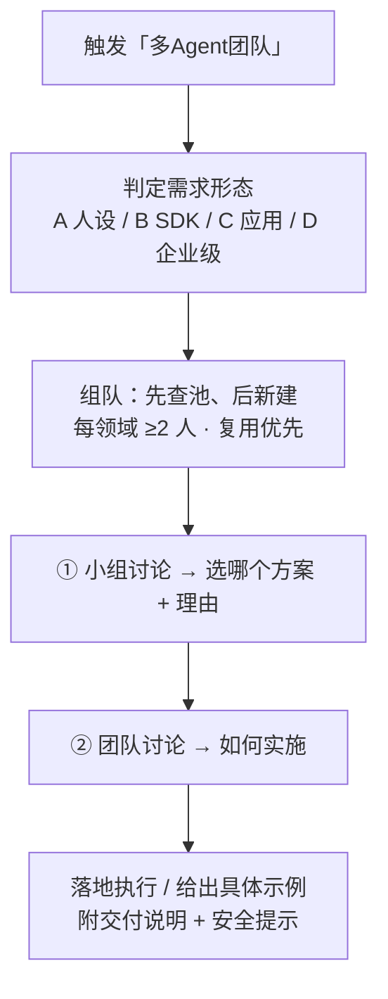

# 技能包：多智能体团队搭建（multi-agent-team）

一句话：**你说一句"帮我组个多 Agent 团队"，它就去角色池里挑合适的 AI 专家，按领域组成小组，经过"小组讨论 → 团队讨论"两级收敛，最后直接给你能跑的方案或具体示例。**

---

## 全景流程



> 全程极度精简：只给结论 + 关键理由（仅约束讨论过程，不约束最终交付物）。

## 这包是干嘛的（大白话）

你不用再纠结"该用哪个多智能体框架"。这个技能把主流多 Agent 框架和**几千个现成 AI 专家人设**整理好了，**你只管说要做什么，它来选型、组队、讨论、落地**。

具体能帮你四件事：

1. **选型不纠结（选完直接用）** —— 你说"想组个小团队跑业务""想一句话变出软件""想做研究"，它对照内置决策表**直接替你定好用哪个框架并马上搭起来**，不跟你讨论"该用哪个"。
2. **组队不手写** —— 从**统一角色池**（335 个唯一角色 / 23 个领域）复用现成专家人设；池里真没有的才新建。
3. **两级讨论收敛** —— 每领域至少 2 名专家组成小组：**小组讨论**比较各 agent 思路、选出最佳方案；**团队讨论**决定如何把这个方案落地到当前任务。
4. **落地可运行** —— 自带可插拔引擎脚手架，改一个 `TEAM` 配置就能跑。先 `--dry-run` 免费预览，配好密钥再真实运行。

## 你为什么需要它

- **省时间**：不用自己读多个框架文档、比来比去。
- **不重复造轮子**：几百个专家人设已有人写好，直接拿。
- **讨论不跑偏**：小组管"选哪个方案"，团队管"怎么实施"，各司其职，不会把分歧原样上抛。
- **安全兜底**：每次落地都提醒代码执行风险、API 费用、数据外发、密钥管理。

---

## 包里有什么

```
multi-agent-team/
├── SKILL.md                        # 技能本体（选型 + 组队铁律 + 团队协作规则 + 安全须知）
├── README.md                       # 本说明
├── UPLOAD.md                       # 上传平台简介（可直接复制）
├── LICENSE                         # MIT
├── references/
│   ├── 框架总览与选型.md            # 5 类能力功能/场景/选型/安全
│   ├── 统一角色池.md                # ★四库去重后的唯一角色池（335 角色/23 领域）——组队用
│   ├── agent-全量清单.md            # ★四库全量 608 条、不去重（标注重复来源）——讨论用
│   ├── 功能与流程总览.md            # ★全部功能与流程的流程图（Mermaid，GitHub 可渲染）
│   └── 团队搭建流程.svg             # 技能运行流程图
└── assets/
    └── multi-agent-team-demo/       # 可运行脚手架（引擎可插拔）
        ├── team_config.py           # ★你只改这一个：TEAM 列表 = 你的团队；ENGINE 选引擎
        ├── build_team.py            # 组建并运行团队（含领域小组人数校验）
        ├── engines/                 # 引擎插件层：统一接口 + lightweight / mock 适配器
        ├── requirements.txt         # 默认引擎依赖（用 mock 可不装）
        ├── .env.example             # 密钥模板
        └── README.md                # 脚手架使用说明
```

> **角色库已单独发布**：4 个角色库的角色内容（583 个角色）在配套仓库
> **https://github.com/zhangruilin158/agent-role-libraries** —— 需要时克隆它即可，原始许可与版权声明保留在仓库的 `LICENSES/`。
> 代码框架源码体积大，仅作参考、未随技能分发。

---

## 两个角色视图（重要：别搞混）

| 视图 | 文件 | 内容 | 用在哪 |
|------|------|------|--------|
| **组队视图**（去重） | `references/统一角色池.md` | **335** 个唯一角色 / 23 个领域 | 最终团队配置，避免重复占位 |
| **讨论视图**（不去重） | `references/agent-全量清单.md` | **608** 条（agent 583 + 工作流技能 25） | 小组讨论招募成员，保留不同视角 |

**为什么讨论要用不去重的清单？** 小组讨论的价值恰恰在于比较不同 agent 的思路差异——哪怕是同名、同职责的 agent，来自不同库、写法不同，给出的方案也可能不同。**重复的也要进组**，这正是"充分比较"的前提。

全量清单四库分布：通用角色库 280 / 中文角色库 278 / 工程专家人设库 21 / 评审专家人设库 29（其中 25 条为工作流技能）。重复条目 454 条、涉及 227 个路径，逐条标注了所属库、路径、核心职责与重复来源。

---

## 团队协作规则（触发"新建团队"时强制）

### 规则一：每领域 ≥2 名专家，组成领域小组
- 按 `domain` 字段分组，每组至少 2 人；单人领域无组内辩驳，禁止。
- 领域可选角色 < 2 时（当前 `research` 与 `integrations` 各 1 个），从相近领域（`academic` / `specialized` / `engineering`）补齐。
- **成员从 `agent-全量清单.md`（不去重）招募**；最终落地的团队配置用 `统一角色池.md`（去重）。

### 规则二：两类讨论分工不同（目的不同、输出不同）

| | **小组讨论**（领域小组内部） | **团队讨论**（跨领域全团队） |
|---|---|---|
| **焦点** | **方案本身** | **方案如何融入当前任务** |
| **要做什么** | 充分比较组内各 agent 思路，辩到收敛 | 落地方式、与既有代码衔接、职责划分、执行顺序 |
| **产出** | **选哪个方案 + 理由**（一条） | **如何实施该方案** |

> 小组负责"做正确的事"，团队负责"把事做正确"。

### 规则三：按顺序收敛（不得跳级）
**小组讨论** → 每领域只出 **1 条**最佳建议（禁把分歧原样上抛）→ **团队讨论**（解决跨域冲突、定执行顺序）→ **输出实施方案并落地**；无法真实执行时给出**具体示例**，不得停在"建议"。

---

## 沟通风格约束（讨论过程）

- 极度精简：只给 **结论 + 关键理由**，最短词句（穴居人式压缩）。
- 禁止：长篇解释、背景铺陈、复述他人内容、套话、客套寒暄。
- 精简只约束**讨论过程**；最终交付物（配置/代码/文档）必须完整可执行。

---

## 默认引擎说明（大白话）

脚手架**默认引擎是「轻量多智能体引擎」**（底层即你保留的 crewai，去品牌后内部命名为 `lightweight`），开箱即用，无需自己选型。
- **可插拔**：除默认 `lightweight`，另内置**零依赖的 `mock` 引擎**——不装任何第三方库也能跑完整流程（`--engine mock`），或先 `--dry-run` 免费预览（连 mock 都不需要）。
- **换引擎**：改 `team_config.py` 的 `ENGINE` / 命令行 `--engine` / 环境变量 `TEAM_ENGINE` 任选其一；新增引擎只需在 `engines/` 写一个适配器类并登记，主流程不动。

> 三种形态速览：①搬现成专家（角色库即插即用）②代码里自己组队（SDK / 轻量引擎脚手架）③开箱应用 / 企业级框架。形态一是"专家池"，形态二/三是"引擎"，可组合。详见 `UPLOAD.md`。

---

## 更多流程图

- **全景流程**：见本文档顶部（Mermaid，GitHub 原生渲染）
- **全部功能与流程（7 张图）**：`references/功能与流程总览.md`
- **单张静态图**：`references/团队搭建流程.svg`

## 怎么装（迁移 / 分享）

把整个 `multi-agent-team/` 文件夹复制到目标机器的技能目录：

- 用户级：`~/.workbuddy-ai/skills/multi-agent-team/`
- 项目级：`<项目>/.workbuddy-ai/skills/multi-agent-team/`

放置后，说「多Agent」「多Agent团队」「帮我新建一个多Agent团队」即可触发。

## 怎么用（最快路径）

```bash
# 1. 进脚手架目录，建虚拟环境并装依赖
python -m venv .venv
.venv\Scripts\pip install -r requirements.txt      # Windows
# .venv/bin/pip install -r requirements.txt        # macOS/Linux

# 2. 先免费预览团队（不调用大模型、不花钱）
.venv\Scripts\python build_team.py --dry-run

# 3. 配密钥后真实运行
copy .env.example .env     # 编辑 .env 填入 API Key（或兼容服务商）
.venv\Scripts\python build_team.py --topic "你的主题"
```

想加角色？打开 `team_config.py`，往 `TEAM` 里复制一个字典改 `domain/source/role/goal/backstory` 即可；
人设从**统一角色池**按 `<领域>/<slug>` 取，新增角色记得填 `domain` + `source`，且**每个领域至少 2 人**。

## 触发词

- 「多Agent」
- 「多Agent团队」
- 「帮我新建一个多Agent团队」

## 组队铁律（触发"新建团队"时强制）

**统一角色池是唯一 Agent 池**，先复用、后新建：
1. 先查**统一角色池**（335 个唯一角色 / 23 个领域），按 `统一角色池/<领域>/<slug>` 定位；
2. 有就直接引用其 `.md` 人设（role/goal/backstory），不重写；每条须带 `domain` + `source`；
3. 池里真没有的才新建（`source` 用 `new:` 前缀），保持同一人设结构，且**名称/职责/能力在领域内唯一**；
4. 落到 `team_config.py` 的 `TEAM`，先 `--dry-run` 验证（含领域小组人数校验）再真实运行。

## 安全提醒（务必看）

- 默认本机让 LLM 生成内容（不执行代码）；若接会跑代码的 Agent，请上沙箱。
- 角色包在你的编码工具中以**同等文件/命令权限**运行，启用前请 Review 人设、警惕 prompt injection。
- 密钥只在 `.env`，绝不硬编码或提交；输入会发往你配置的大模型服务商，**别喂密钥或隐私数据**。
- 真实运行按 token 计费，先用便宜的入门模型试跑。
