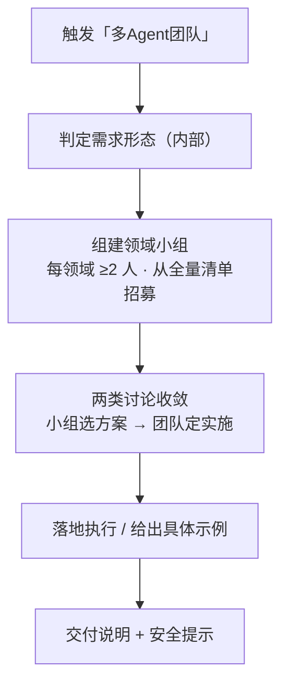
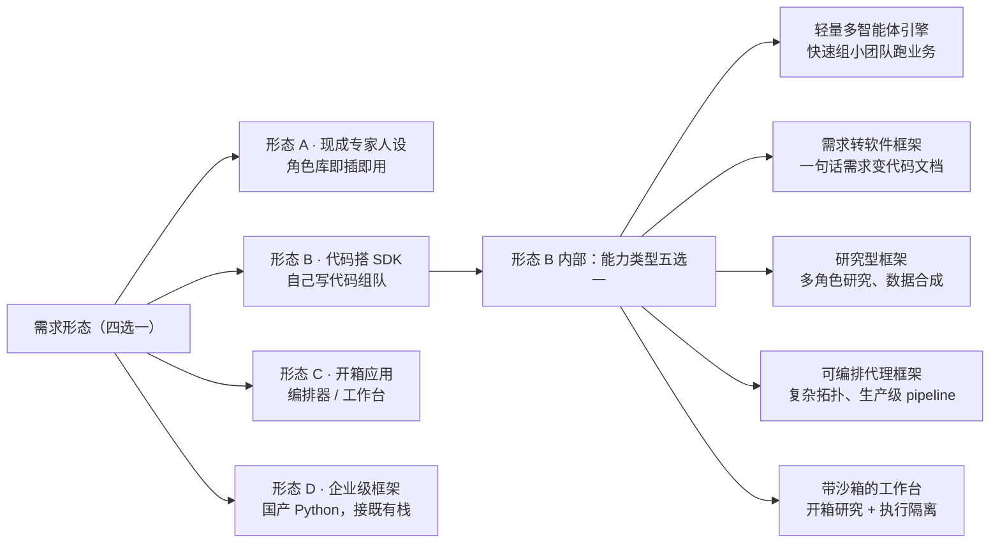
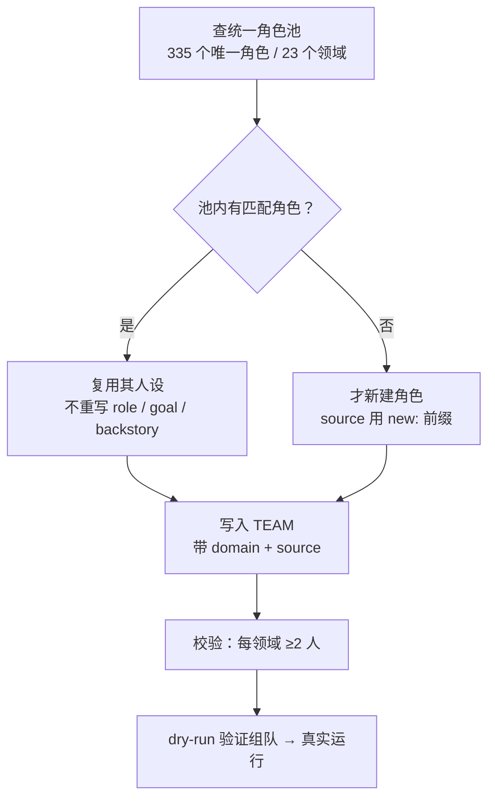
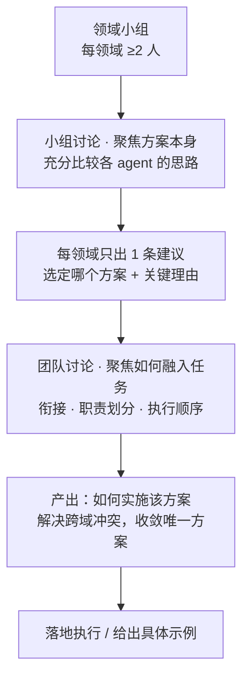
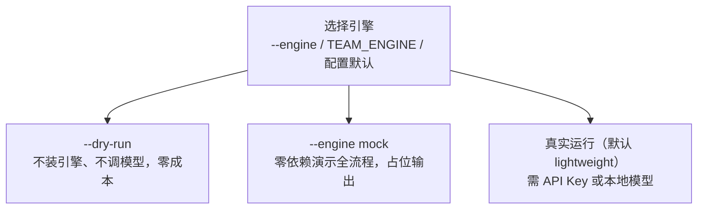
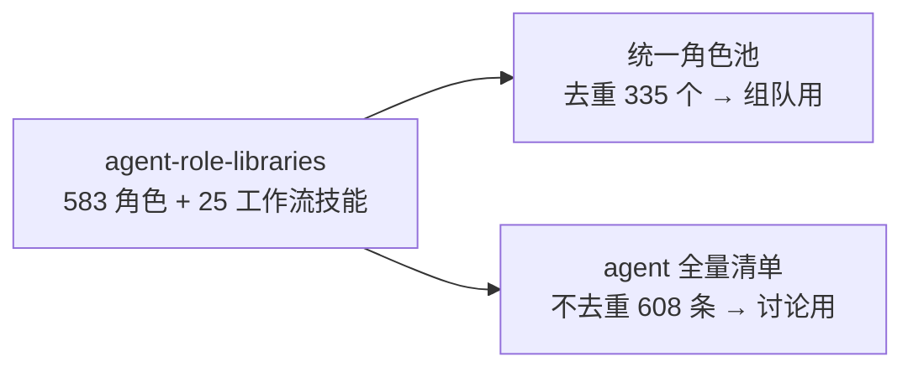
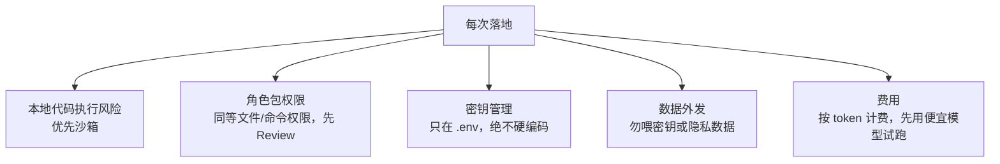

# 功能与流程总览

> 本文件用流程图汇总技能的全部功能与流程。
> 下面用 Mermaid 编写，在 GitHub / 支持 Mermaid 的 Markdown 阅读器里**可直接渲染成图**。

## ① 端到端主流程

## ② 需求形态判定 → 能力类型

## ③ 组队铁律：先查池、后新建

## ④ 两类讨论与收敛（核心规则）

**两类讨论的分工**：

| | 小组讨论（领域小组内部） | 团队讨论（跨领域全团队） |
|---|---|---|
| 焦点 | 方案本身 | 方案如何融入当前任务 |
| 产出 | 选哪个方案 + 理由 | 如何实施该方案 |

**沟通约束**：全程极度精简，只给结论 + 关键理由（仅约束讨论过程，不约束最终交付物）。

## ⑤ 落地运行：引擎可插拔

## ⑥ 角色资源：双视图

> 为什么讨论要用不去重的？小组讨论的价值在于**比较不同 agent 的思路差异**——同名同职责但来自不同库的 agent，给出的方案可能不同，所以重复的也要进组。

## ⑦ 安全须知（每次落地必提示）

